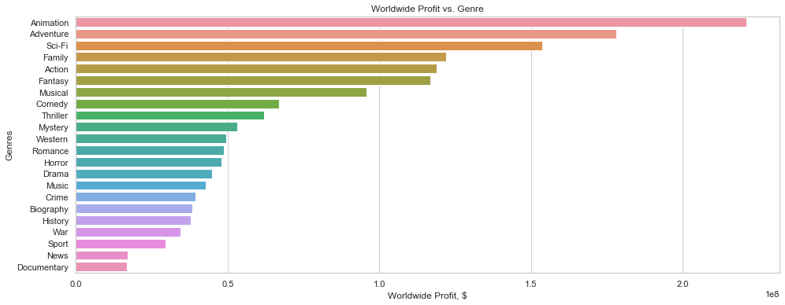

# Module 1 Final Project

## Outline
-----------------------------------------
    ├── LICENSE
    ├── README.md                  <- The project layout (this file)
    ├── zippedData                 <- This is where the project data is located
    │
    ├── student.ipynb              <- This is the main notebook 
    │
    ├── reports                    <- Reports and presentations
    │   └── presentation.pdf       <- Non-technical presentation
    │   └── video_walkthrough      <- Link to video walkthrough
    │
    ├── images                     <- Where the graphs are saved
    ├── requirements.txt           <- The requirements file for reproducing the analysis environment

## Conclusion

### What is the relationship between domestic profit and worldwide profit?

According to the above line plot, there is a positive relationship between domestic profit and worldwide profit with a slope greater than 1.

### Which genres generate the highest worldwide profit?

According to the above bar plot, Worldwide Profit vs Genres, the five genres with the highest worldwide profit, in order, are: Animation, Adventure, Sci-Fi, Family, and Action.

### Which months generate the highest worldwide profit?

According to the above bar plot, Month vs Worldwide Profit, the five months that generate the highest worldwide profit, in order, are: May, June, July, November, and December.

### What are the top 5 profit genres for each month?

According to the bar graphs above, the 5 genres that generate the highest worldwide profits for each month are, in order:

    January: Animation, Musical, Horror, Sci-Fi, and Thriller.

    February: Western, Animation, Adventure, Action, and Family.

    March: Musical, Family, Animation, Fantasty, and Adventure.

    April: Adventure, Animation, Family, Sci-Fi, and Action.

    May: Animation, Sci-Fi, Adventure, Action, and Fantasty.

    June: Animation, Adventure, Sci-Fi, Action, and Fantasty.

    July: War, Animation, Musical, Adventure, and Sci-Fi.

    August: Mystery, Adventure, Fantasty, Action, and Thriller.

    September: Animation, Family, Sci-Fi, Adventure, and Horror.

    October: Sci-Fi, Animation, Thriller, Horror, and Mystery.

    November: Animation, Adventure, Family, Fantasty, and Sci-Fi.

    December: Fantasy, Adventure, Action, Family, and Animation.

## Recommendations

Based on the above information, it is recommended that a movie is released in May, June, July, November, or December. 

If the movie is released in May, focus on these three genres: Animation, Sci-Fi, and/or Adventure. 
If the release month is June, focus on: Animation, Adventure, and/or Sci-Fi. 
If the release month is July, focus on: War, Animation, and/or Musical. 
If the release month is November, focus on: Animation, Adventure, and/or Family. 
And if the release month is in December, focus on: Fantasty, Adventure, and/or Action.

If the release month cannot be pre-determined, then focus on the following genres: 
Animation, Adventure, Sci-Fi, Family, and/or Action.

There is a positive correlation, with a slope greater than 1, between domestic profit and worldwide profit, thus worldwide profit is used as the metric for success. 